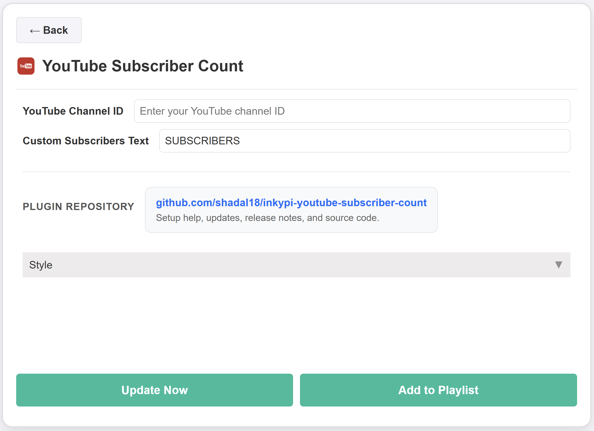

# InkyPi YouTube Subscriber Count

A custom InkyPi plugin that shows a YouTube channel subscriber count on an e-paper display with a clean, glanceable layout and simple channel-based configuration.

_YouTube Subscriber Count_ is a plugin for [InkyPi](https://github.com/fatihak/InkyPi) that displays live subscriber counts for a YouTube channel on your e‑ink frame.

## Install

Use the InkyPi plugin installer with the plugin ID and this repository URL, following the install pattern shown by the official InkyPi plugin template.

```bash
inkypi plugin install youtube_subscriber_count https://github.com/shadal18/inkypi-youtube-subscriber-count
```

## Update

To update the plugin on your InkyPi device:

1. SSH into your InkyPi host.
2. Change into the plugin directory:
   ```bash
   cd ~/InkyPi/src/plugins/youtube_subscriber_count
   ```
3. Run this update command:
   ```bash
   git pull origin main && \
   if [ -d youtube_subscriber_count ]; then \
     rsync -a youtube_subscriber_count/ ./ && \
     rm -rf youtube_subscriber_count; \
   fi && \
   sudo systemctl restart inkypi.service
   ```

If you don’t see your changes after updating:

- Confirm you are in the correct plugin folder.
- Clear your browser cache or hard refresh the InkyPi web UI.
- Check the InkyPi logs for any plugin errors.

## Requirements

- A valid YouTube Data API key with access to YouTube Data API v3.
- A YouTube channel ID for the channel you want to display.
- Network access from the InkyPi device to the YouTube Data API.

## Features

This plugin is an extension for the InkyPi e-paper display frame and includes the following features.

- Shows YouTube subscriber count for a selected channel.
- Uses the YouTube channel ID as the lookup target.
- Supports a custom header label such as `SUBSCRIBERS`.
- Formats subscriber count with thousands separators for readability.
- Uses the YouTube channel statistics endpoint as the data source.

## Settings

The plugin settings page lets you customize:

- YouTube channel ID.
- Custom subscribers text.

## API Key Setup

This plugin requires a YouTube API key.

### Create a YouTube API key

1. Go to [https://console.cloud.google.com/](https://console.cloud.google.com/).
2. Create a new Google Cloud project.
3. Open **APIs & Services**.
4. Enable **YouTube Data API v3**.
5. Open **Credentials**.
6. Click **Create Credentials** and choose **API key**.
7. Copy the generated API key.

### Add the key in InkyPi

1. Open the InkyPi front page.
2. Click the **key icon**.
3. Add a new key named `YOUTUBE_API_KEY`.
4. Paste in your YouTube API key.
5. Save it.
6. Restart InkyPi if needed.

## Channel ID

To find your YouTube channel ID:

1. Sign in to YouTube.
2. Open **Settings** for the account.
3. Go to **Advanced settings**.
4. Copy the **Channel ID** value.

Use that Channel ID in the plugin settings page.

## Repository

GitHub repository:

[https://github.com/shadal18/inkypi-youtube-subscriber-count](https://github.com/shadal18/inkypi-youtube-subscriber-count)

## Screenshots

- Main plugin display showing the subscriber count.
- Plugin settings screen.

<p align="center">
  
  
</p>
